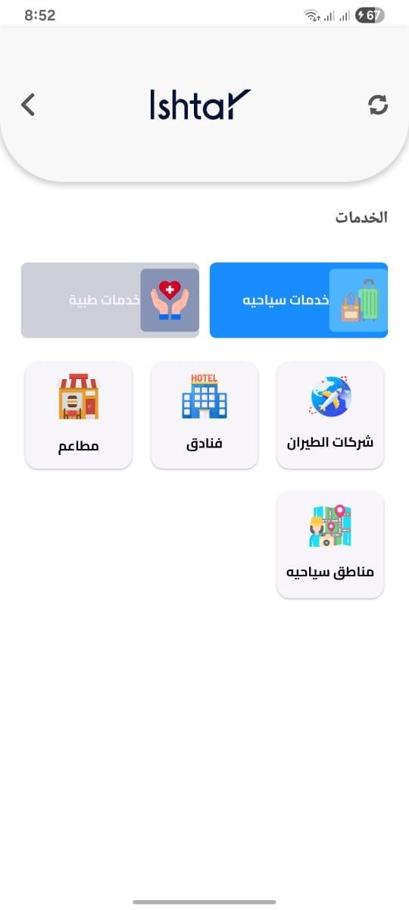

# ishtar

The application provides services to the user, including medical services such as searching for hospitals, doctors, etc., as well as tourism services such as traveling to places, searching for hotels, etc. 

## Packages  && usage
 cubit
 get_it
 firebase
 clean architecture
 easy localization
 responsive screens

## Screens
 
 
 
 
 
 
 
 
 
 
 
 
 
 
 
 
 
 
 
 
 
 
 
 
